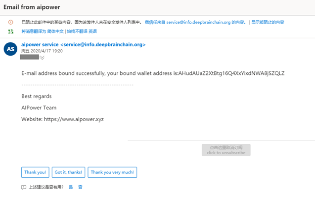

# 🛸 AI-Power 
- AI Power GPU Cloud Platform Guide, [CN: Switch to Chinese version](README.md).
- QQ group:`811516112`，[🖼 QR code](resource/AI动力-GPU云平台群聊二维码.png)
- WeChat group：[🖼 QR code](resource/微信群.png)，If the QR code is expired, please contact WeChat ID `ly18597591102` to join the group
- WeChat Official Account：`aipowergpu`，[🖼 QR code](resource/公众号.jpg)
- If you have any questions, please issue or discuss in the group
- [🎬 YouTube video](https://www.youtube.com/watch?v=zMdAmQf4iuc)

## 🎉 Regular Activities
- Tip: DBC is integral and can be used to rent GPUs
1. New users can get free 💸 2400 DBC, equivalent to 12 to 24 hours RTX2080 (price floating over time). For registration and receiving process, please refer to the following chapters.
2. User can get 💸2400DBC by inviting a new user, there is no upper limit.
3. User can get 💸2400DBC by releasing a piece of news in your Moments or any other sharing platforms and getting 10 likes
4. User can get 💸2000DBC by posting a WeChat official account article and getting a reading volume of 100
5. If you invite 10 new users, there will be an additional 🤖Bluetooth speaker

## 🔮 Time-limited activities in April
- Under the joint efforts of everyone, DBC network’s tight supply problem was greatly reduced. The category and quality of machines in the network have been constantly enriched and improved. Next, we will put on a batch of cheap 1080TI/P102 GPUs to meet your needs. Meanwhile, there is a new round of activities:
  - 🕗 Time Limitation：`2020/4/13 10:00 — 2020/4/20 22:00`
  - 1、💎5000DBC for a new user，💎4000DBC for inviting a new user.(Double bonus for international users)
  - 2、If you had invited 5 new users during the activity time, there is an additional 🎼bluetooth speaker
  - 3、Users who recharge for 336 hours can get a 🎼bluetooth speaker
  - 6、🔥 Those who invite the highest number of new users in a single day during the event will get extra 💎1000DBC + 👑1 week 5% cash-back，Statistics include QQ group data and WeChat group data. If there are multiple winners at the same time, they will be rewarded equally, and the cash-back time can be superimposed!
  - 7、🌀 The person who invite the highest number of new users during the event will get extra 👑3 month 5% cash-back! Number two, 👑1 month 5%! Number three 👑1 week 5%.
  - 8、💟 Group reward: if the total number of AI Power users reaches 100 after the end of the event, all rental expenses generated by all users during the event period can enjoy the rebate of "1%"; Up to 200 people, "2%; Up to 300% or more", 3%. And the percentage of cash back can be superimposed with activity 6 or 7.
  - [⚔ Ranking List 🏟](#-Ranking-List)

# 目录
- [🕹 Administrators](#-Administrators)
- [✨ Registration with Rewards](#-Registration-with-Rewards)
- [🗝 Login](#-Login)
- [📃 Rent](#-Rent)
- [🐛 FAQ](#-FAQ)
  - [How to monitor GPU?](#-How-to-monitor-GPU)
  - [How to get DBC?](#-How-to-get-DBC)
  - [How to transfer?](#-How-to-transfer)
  - [How to sell?](#-How-to-sell)
  - [How to apply for invoice?](#-How-to-apply-for-invoice)
  - [What operating system is the server?](#-What-operating-system-is-the-server)
  - [What is the CUDA version?](#-What-is-the-CUDA-version)
  - [How to use Pycharm to connect to the server?](#-How-to-use-Pycharm-to-connect-to-the-server)
  - [Why is there no preset frame?](#-Why-is-there-no-preset-frame)
  - [Where is the jupyter file path?](#-Where-is-the-jupyter-file-path)
  - [What is the python version?](#-What-is-the-python-version)
- [💫 Propaganda Picture](#-Propaganda-Picture)
# 🕹 Administrators
- Promotion Administrator（Wechat ID：DBC-Lee，WeChat nickname：DBC / QQ ID：191279367）：Responsible for reviewing/issuing registration awards
- Technical Administrator（Wechat ID：fengbs600220，WeChat nickname：deepbrainfeng）：Responsible for technical after-sales service

# ✨ Registration with Rewards
1. **Use PC browser to open [`🚀AI Power`](https://www.aipower.xyz) website [www.aipower.xyz](https://www.aipower.xyz)**
2. Click "start renting GPU"
- 
3. Click "create wallet account"
- 
4. Enter your password and click "create"
- 
5. Download the encrypted file and save it. Click "continue"
- 
6. Copy the private key and save it, then click finish
- 
7. Click “How to buy DBC” and buy at least 1 DBC (1 DBC less than $0.001. If you are concerned about privacy issues, you can also contact me at WeChat ID ly18597591102, I will give you 1 DBC for free to skip this step.)
- 
8. Go back to 🚀`AI Power`, copy your address，and then click “我的GPU容器(My GPU container)”
- 
9. Click “Email”
- 
10. Click “Receive email” and you will receive an email with a number, enter the number and click “binding”
- 
- 
11. After binding, open a new received email and take a screenshot. Fill in the referrer's address `AeiBc1hjnCxhFhS7bujHuathgzot8ztQb6`(Fill in the address of your referrer, or this if there is no special referrer. This address does not participate in leaderboard rewards and will not become a competitor). Send a message to the [group (Click here to join)](#-AI-Power) and @DBC
  (WeChat Group：@DBC，QQ Group：@191279367)([🕹 Administrators](#-Administrators)), Please ensure that all information is filled in completely (please refer to the figure below for the screenshot).
- format：
  ```python
  Referrer's address：
  AeiBc1hjnCxhFhS7bujHuathgzot8ztQb6
  My address：
  [Fill in your wallet address here]
  [Mail screenshot of successful mailbox binding]
  * The screenshot of the email should include the receiving time. If you are concerned about the privacy of the message, you can block the receiving address by typing
  * If you are an international user, please note (international)
  ```
- 
12. The administrator will deal with it after seeing it. Just wait
13. After obtaining DBC, please refer to [📃 Rent](#-Rent). On the server, you can execute 'python3' command to run script, and 'pip3' to install library
# 🗝 Login
- Two method：
  - Encrypted file login: select the encrypted file saved when registering and enter the password
  - Private key login: enter the private key
# 📃 Rent
1. Download SSH tool [`MobaXterm`](https://drive.google.com/open?id=1RPuF9x20oFYNsfPw03F2wFVmelo1npUr)
2. Open 🚀`AI Power` website, click “machine llist”, wait about 10 seconds for the list of available machines to be displayed. Then choose one server to trial or rent. It is recommended to set a little more time, when the time is over, the system will automatically shut down the server. If the task runs out in advance, you can go to "my GPU list" and cancel the rental, the rest of the time will be returned to your account by DBC.
- 
3. Confirm the order
- 
4. It will jump to the corresponding CPU/GPU container page and let’s wait for the system to check the machine environment
- 
5. After the check, let's click “支付(pay)” and then you will receive an email containing the account and password of the server and some information
- 
6. Open MobaXterm and select "New session" to create a New connection
- 
7. Enter the server address and port number, and then click OK
- 
8. Enter the account(root) and the password (No characters are displayed during the input). Press enter and click "Yes"
- 
9. After successfully logging in, you can use the server normally. You can manage the server files on the left and  there is a terminal on the right. Enter the `server file name .py` to run the python script, which has been preinstalled with Pytorch, Tensorflow, and so on the right. During formal training, it is recommended to use the screen command (`screen -S name`) to create an offline terminal. The training file on the offline terminal is more stable. Even if you exit locally, the server will continue to execute the script. The next time you log in to the server, you can use the command `screen -r -d name` to enter the previously created terminal.
- 
- By configuring `X11-uploding`, you can even write scripts directly in the local graphical interface or display the graphical interface of the server-side software.
- 
# 🐛 FAQ
- This column summarizes solutions to common problems. Please try the following solutions first. If you still can't solve them, please contact the technical administrator ([🕹 Administrators](#-Administrators)).
- On the PC side, it is recommended to use 【Ctrl】 + 【F】 to locate the problem.
## ☄ How to monitor GPU?
- command: `watch -n 1 nvidia-smi`
## ☄ How to get DBC?
- a. Take part in the [activities](#-Regular-Activities) to get free DBC.
- b. Open “[🚀`AI Power`](https://www.aipower.xyz) - My Wallet - How to buy DBC (blue font)” and recharge.
- c. Open "[Lease GPU](https://www.aipower.xyz/miner/myMachineUnlock)" to get DBC.
## ☄ How to transfer?
- Open [🚀`AI Power`](https://www.aipower.xyz), Enter “My Wallet”, Enter the receiver's address and transfer amount in the transfer box and click "send".
## ☄ How to sell?
- Open “[🚀`AI Power`](https://www.aipower.xyz) - My Wallet - 如何出售DBC(orange font)”, Choose the right way to sell.
## ☄ How to apply for invoice?
- Please contact the promotion administrator, we will dock with the financial staff.
## ☄ What operating system is the server?
- The operating system of each machine may be different, including Ubuntu16/18/19, etc. Please refer to "Machine list" for details.
- 
## ☄ What is the CUDA version?
- Generally, it is 10.0. The situation of each machine may be different. You can check it through trial first and entering the command `nvcc-V`.
## ☄ How to use Pycharm to connect to the server?
- Only Professional version of Pycharm has ssh interpreter function.
## ☄ Why is there no preset frame?
- Only python3 has a preset frame. Enter `python3 fileName.py` to run your files. You can use `pip3 install frameName` or upload a wheel to install a frame.
## ☄ Where is the jupyter file path?
- `/code`
- We can use `!pwd` to get the current path.
## ☄ What is the python version?
- we can choose the mirror when we rent the machine.
  - for pytorch1.1 version mirror, the default are python3.5 and python2.7. And we can use `conda activate python367` to activate python3.67, and `conda deactivate` to go back.
  - for pytorch1.4 version mirror, python3.67 has been activated. After deactivating, they are python3.7 and python2.7.
# ⚔ Ranking List
- 👨‍👨‍👧‍👦  Currently, there are **70** members.

- 2020/4/18 🏹 One-day ranking：
  |Referrer's address|Number of invited persons|  
  |------|---|
  |AHNoU...|3|
  |AdQcN...|1|
  |AdQcN...|1|
  |ALsVs...|1|
  |AZkXa...|1|
  - `Data update time：2020/4/18 18:51，Please contact group manager for any omission`
  
- 🎊 Universal ranking：
  |Referrer's address|Number of invited persons|   
  |------|---|
  |AUeSs...|7|
  |ATACW...|5|
  |AdgxR...|5|
  |AHNoU...|5|
  |AHJou...|3|
  |AKWNq...|3|
  |AUZub...|2|
  |AcooT...|1|
  |Ac1pK...|1|
  |ANjHp...|1|
  |AKMqD...|1|
  |AWtBD...|1|
  |AdQcN...|1|
  |ALsVs...|1|
  |AZkXa...|1|

- Former champions：
  |Date|champions|  
  |------|---|
  |2020/4/13|AdgxR.../ATACW.../AUZub...|
  |2020/4/14|AdgxR...|
  |2020/4/15|AHJou...|
  |2020/4/16|AKWNq...|
  |2020/4/17|AUeSs...|
# 💫 Propaganda Picture
- in production
