# 🛸 AI-Power 
- AI Power GPU Cloud Platform Guide, [CN: 切换为中文版](README.md).
- QQ group:`811516112`，[🖼 QR code](resource/AI动力-GPU云平台群聊二维码.png)
- WeChat group：[🖼 QR code](resource/微信群.png)，If the QR code is expired, please contact WeChat ID `ly18597591102` to join the group
- WeChat Official Account：`aipowergpu`，[🖼 QR code](resource/公众号.jpg)
- If you have any questions, please issue or discuss in the group
- [🎬 YouTube video](https://www.youtube.com/watch?v=zMdAmQf4iuc)

## 🎉 Regular Activities
- Tip: DBC is integral and can be used to rent GPUs
1. New users can get free 💎500 DBC, and if the usage reaches 500 DBC in first week, you can get an additional 💎500 DBC, total 💎1000 DBC (price floating over time). For registration and receiving process, please refer to the following chapters. (**Double** the international user rewards, please contact group manager)
2. User can get 💎500 DBC by inviting a new user, and if the usage of new user reaches 500 DBC in first week, you can get an additional 💎500 DBC. (**Double** the international user rewards, please contact group manager)
3. User can get 💎2400 DBC by releasing a piece of news in your Moments or any other sharing platforms and getting 10 likes.
4. User can get 💎2000 DBC by posting a WeChat official account article and getting a reading volume of 100.
5. If you invite 10 new users, there will be an additional 🎼Bluetooth speaker.
6. User can get 💎2000 DBC by thumbing up and commenting on the [YouTube video](https://www.youtube.com/watch?v=zMdAmQf4iuc).

## 🌕 October Activity
1. If the user uses the long-term lease function (monthly, quarterly) during the event, and does not cancel the lease. In addition to enjoying the discounts marked on the platform, users can also receive additional subsidies (5%);
2. Inviting a real GPU user (competition users, graduate students first) during the activity can get 4000DBC, and each user can invite up to 10 people (40,000DBC). Cheating will result in disqualification; As long as the cumulative number of invitations reaches 5, you can get a T-shirt. 10 people, one Bluetooth speaker;
3. New users can get free 2500 DBC, and if the usage reaches 2500 DBC in the first week, you can get an additional 2500 DBC. (Double the international user rewards)
4. Promote in Moments or Qzone (at least 24 hours + 10 likes), each rewards 2500DBC; Artificial intelligence related QQ groups, WeChat groups (more than 200 people, the number is not limited if the group is a class group), each rewards 500DBC; Zhihu , Bilibili, etc. Like and comment: 1000DBC​;
5. ⏳ Time：2020 10.10 10:00 - 10.17 22:00.

# Catalogue
- [🕹 Administrators](#-Administrators)
- [✨ Registration with Rewards](#-Registration-with-Rewards)
- [🗝 Login](#-Login)
- [📃 Rent](#-Rent)
- [🐛 FAQ](#-FAQ)
  - [How to monitor GPU?](#-How-to-monitor-GPU)
  - [How to get DBC?](#-How-to-get-DBC)
  - [How to transfer?](#-How-to-transfer)
  - [How to sell?](#-How-to-sell)
  - [How to apply for invoice?](#-How-to-apply-for-invoice)
  - [What operating system is the server?](#-What-operating-system-is-the-server)
  - [What is the CUDA version?](#-What-is-the-CUDA-version)
  - [How to use Pycharm to connect to the server?](#-How-to-use-Pycharm-to-connect-to-the-server)
  - [Why is there no preset frame?](#-Why-is-there-no-preset-frame)
  - [Where is the jupyter file path?](#-Where-is-the-jupyter-file-path)
  - [What is the python version?](#-What-is-the-python-version)
  - [How to forward server port for tensorboard/jupyter, etc?](#-How-to-forward-server-port-for-tensorboardjupyter-etc)
  - [How to transfer files?](#-How-to-transfer-files)
  - [Will the data be saved after expiration?](#-Will-the-data-be-saved-after-expiration)
  - [What are the charging rules?](#-What-are-the-charging-rules)
- [💫 Propaganda Picture](#-Propaganda-Picture)
# 🕹 Administrators
- Promotion Administrator（Wechat ID：DBC-Lee，WeChat nickname：DBC / QQ ID：191279367）：Responsible for reviewing/issuing registration awards
- Technical Administrator（Wechat ID：fengbs600220，WeChat nickname：deepbrainfeng）：Responsible for technical after-sales service

# ✨ Registration with Rewards
1. **Use PC browser to open [`🚀AI Power`](https://www.aipower.xyz) website [www.aipower.xyz](https://www.aipower.xyz)**
2. Click "start renting GPU"
- 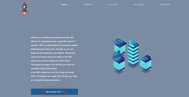
3. Click "create wallet account"
- 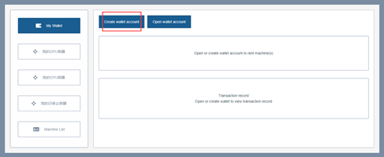
4. Enter your password and click "create"
- 
5. Download the encrypted file and save it. Click "continue"
- 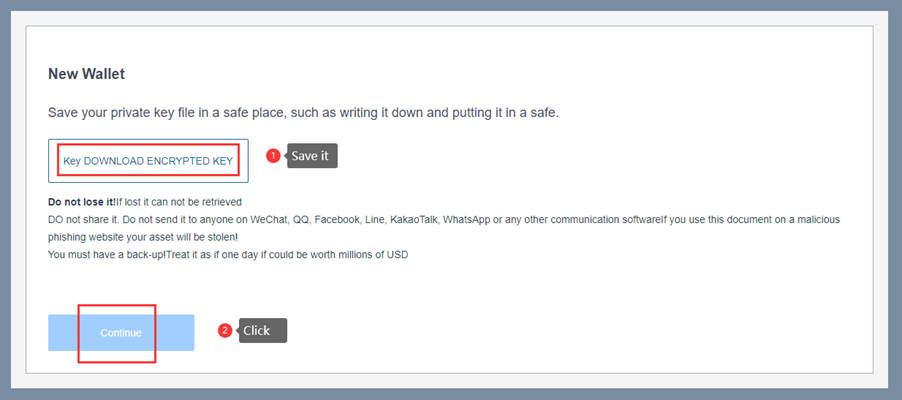
6. Copy the private key and save it, then click finish
- 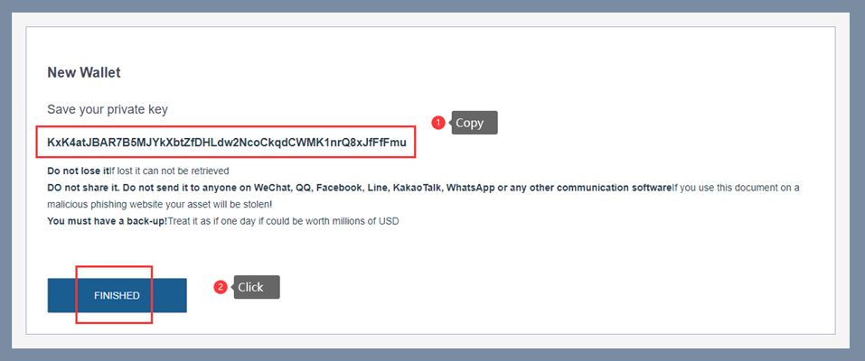
7. Click “How to buy DBC” and buy at least $0.15 to bind the mailbox. If you have alipay, you can also switch the language to Chinese by clicking the button in the top right corner and then pay with alipay
- 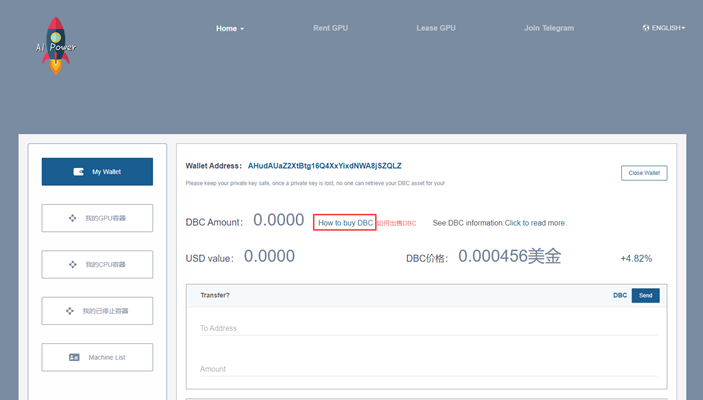
8. Go back to 🚀`AI Power`, copy your address，and then click “我的GPU容器(My GPU container)” (The DBC you just topped up will arrive in a few minutes)
- 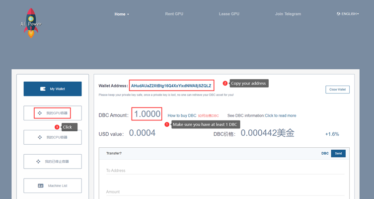
9. Click “Email”
- 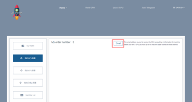
10. Click “Receive email” and you will receive an email with a number, enter the number and click “binding”
- 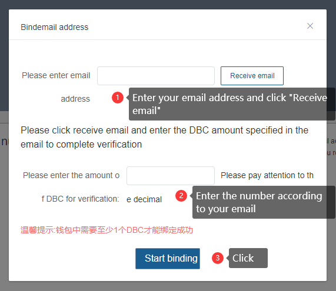
- 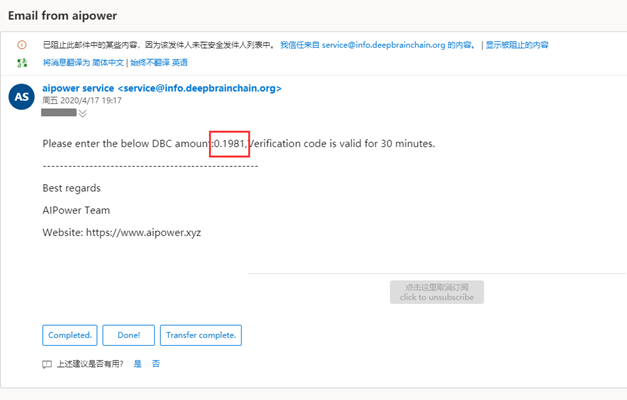
11. After binding, Fill in the referrer's address (Fill in the address of your referrer, or skip this if there is no special referrer), your wallet address and the screenshot. Send a message to the [group (Click here to join)](#-AI-Power) and @DBC
  (WeChat Group：@DBC，QQ Group：@191279367)([🕹 Administrators](#-Administrators)), Please ensure that all information is filled in completely (please refer to the figure below for the screenshot).
- format：
  ```python
  Referrer's address：
  
  My address：
  
  [screenshot of your wallet]
  * If you are an international user, please contact the group manager to get double rewards.
  ```
- 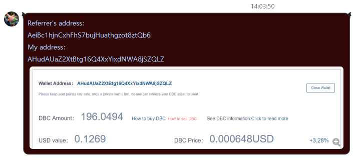
12. The administrator will deal with it after seeing it. Normally within one day, please wait
13. After obtaining DBC, please refer to [📃 Rent](#-Rent). On the server, you can execute 'python3' command to run script, and 'pip3' to install library
14. If your DBC usage for the first week is no less than 1000, you can send the order and balance screenshots to the group and @dbc to get more free DBC
# 🗝 Login
- Two method：
  - Encrypted file login: select the encrypted file saved when registering and enter the password
  - Private key login: enter the private key
# 📃 Rent
1. Download SSH tool [`MobaXterm`](https://drive.google.com/open?id=1RPuF9x20oFYNsfPw03F2wFVmelo1npUr)
2. Open 🚀`AI Power` website, click “machine llist”, wait about 10 seconds for the list of available machines to be displayed. Then choose one server to trial or rent. It is recommended to set a little more time, when the time is over, the system will automatically shut down the server. If the task runs out in advance, you can go to "my GPU list" and cancel the rental, the rest of the time will be returned to your account by DBC.
- 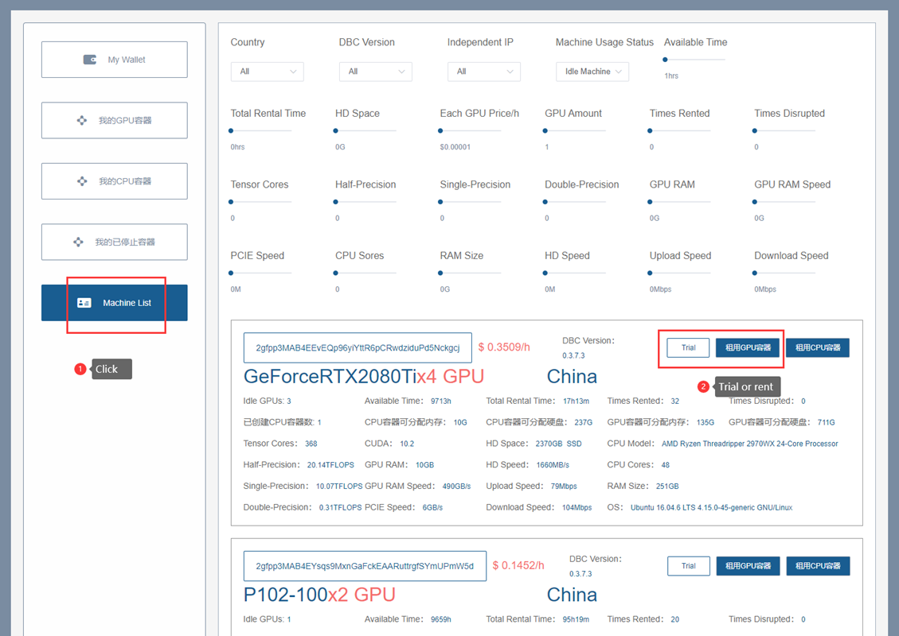
3. Confirm the order
- 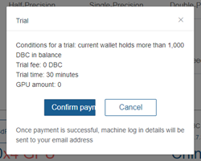
4. It will jump to the corresponding CPU/GPU container page and let’s wait for the system to check the machine environment
- 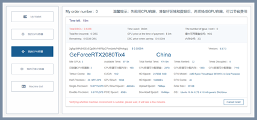
5. After the check, let's click “支付(pay)” and then you will receive an email containing the account and password of the server and some information
- 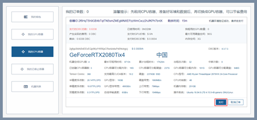
6. Open MobaXterm and select "New session" to create a New connection
- 
7. Enter the server address and port number, and then click OK
- 
8. Enter the account(root) and the password (No characters are displayed during the input). Press enter and click "Yes"
- 
9. After successfully logging in, you can use the server normally. You can manage the server files on the left and  there is a terminal on the right. Enter the `server file name .py` to run the python script, which has been preinstalled with Pytorch, Tensorflow, and so on the right. During formal training, it is recommended to use the screen command (`screen -S name`) to create an offline terminal. The training file on the offline terminal is more stable. Even if you exit locally, the server will continue to execute the script. The next time you log in to the server, you can use the command `screen -r -d name` to enter the previously created terminal.
- 
- By configuring `X11-uploding`, you can even write scripts directly in the local graphical interface or display the graphical interface of the server-side software.
- 
# 🐛 FAQ
- This column summarizes solutions to common problems. Please try the following solutions first. If you still can't solve them, please contact the technical administrator ([🕹 Administrators](#-Administrators)).
- On the PC side, it is recommended to use 【Ctrl】 + 【F】 to locate the problem.
## ☄ How to monitor GPU?
- command: `watch -n 1 nvidia-smi`
## ☄ How to get DBC?
- a. Take part in the [activities](#-Regular-Activities) to get free DBC.
- b. Open “[🚀`AI Power`](https://www.aipower.xyz) - My Wallet - How to buy DBC (blue font)” and recharge.
- c. Open "[Lease GPU](https://www.aipower.xyz/miner/myMachineUnlock)" to get DBC.
## ☄ How to transfer?
- Open [🚀`AI Power`](https://www.aipower.xyz), Enter “My Wallet”, Enter the receiver's address and transfer amount in the transfer box and click "send".
## ☄ How to sell?
- Open “[🚀`AI Power`](https://www.aipower.xyz) - My Wallet - 如何出售DBC(orange font)”, Choose the right way to sell.
## ☄ How to apply for invoice?
- Please contact the promotion administrator, we will dock with the financial staff.
## ☄ What operating system is the server?
- The operating system of each machine may be different, including Ubuntu16/18/19, etc. Please refer to "Machine list" for details.
- 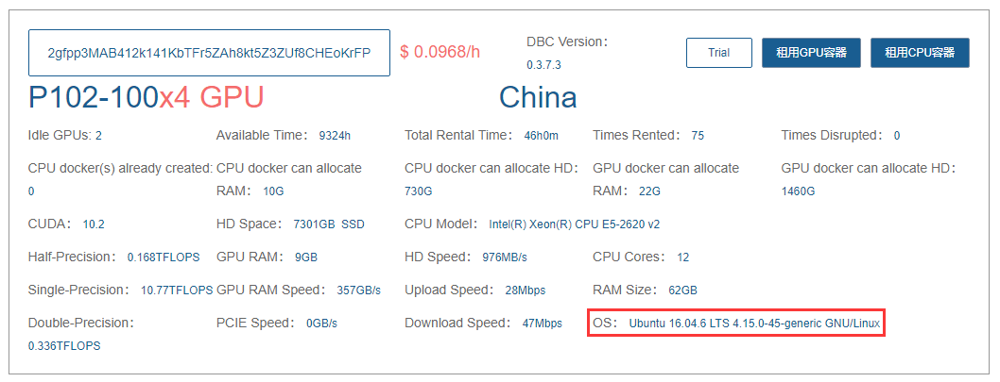
## ☄ What is the CUDA version?
- Generally, it is 10.0. The situation of each machine may be different. You can check it through trial first and entering the command `nvcc-V`.
## ☄ How to use Pycharm to connect to the server?
- Only Professional version of Pycharm has ssh interpreter function.
## ☄ Why is there no preset frame?
- Only python3 has a preset frame. Enter `python3 fileName.py` to run your files. You can use `pip3 install frameName` or upload a wheel to install a frame.
## ☄ Where is the jupyter file path?
- `/code`
- We can use `!pwd` to get the current path.
## ☄ What is the python version?
- We can choose the mirror when we rent the machine.
  - For pytorch1.1 version mirror, the default are python3.5 and python2.7. And we can use `conda activate python367` to activate python3.67, and `conda deactivate` to go back.
  - For pytorch1.4 version mirror, python3.67 has been activated. After deactivating, they are python3.7 and python2.7.
## ☄ How to forward server port for tensorboard/jupyter, etc?
- Method 1. Configure the x11-forwarding to forward server GUI, and then launch the browser on the server.
- Method 2
  - Open mobaXterm's tunnel
  - 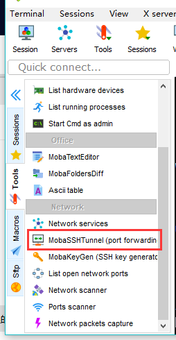
  - Fill out the forwarding information.
  - Start it
  - 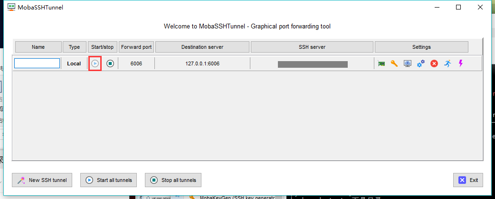
  - Open recived port on your local browser, for example: `127.0.0.1:6006`.
## ☄ How to transfer files?
- For small files, you can transfer them through the left graphical interface of the MobaXterm.
- For large files, it is recommended to transfer through the private network disk provided in the email you receive at the time of rental, which is fast.
## ☄ Will the data be saved after expiration?
- When the lease expires, the container will be deactivated. If your wallet balance is less than 20000DBC, the container will be destroyed immediately. If your wallet balance exceeds 20000DBC, all data will be automatically retained for 7 days (the wallet balance must also exceed 20000DBC during this period).
- In addition, data can be saved by renting the CPU container, and no charge will be incurred by pledging DBC, but the charge will be charged by renting it.
## ☄ What are the charging rules?
- The price of each machine is different, so it is recommended to choose the most cost-effective one.
- You can withdraw the rental in advance, only the actual fees will be charged, and the remaining fees will be returned to your wallet.

# 💫 Propaganda Picture
- in production
