# 🛸 AI-Power
AI动力(AI Power) GPU云平台使用指南，[EN: Switch to English version](README-en.md)
- QQ群:`811516112`，[🖼二维码](resource/AI动力-GPU云平台群聊二维码.png)
- 微信群：[🖼二维码](resource/微信群.png)，如果二维码过期，请联系微信号`ly18597591102`加群
- 微信公众号：`aipowergpu`，[🖼二维码](resource/公众号.jpg)
- 如有疑问欢迎发issue，或在群内讨论
- [📕 CSDN介绍文](https://blog.csdn.net/qq_34361099/article/details/105440223) | [📺 bilibili视频介绍及租用演示](https://www.bilibili.com/video/BV1QK411V7nv)

## 🎉 常规活动
- 注：DBC指算力积分，可用于租用算力
1. 现在注册即可获得💸2400DBC，等价于12至24小时RTX2080（价格随时间浮动），注册及领取流程请参考以下章节
2. 邀请新用户，邀请人和被邀请人均可获得💸2400DBC
3. 转发朋友圈或QQ空间并获得10赞或以上，奖励💸2400DBC
4. 微信公众号宣传100以上阅读量，奖励💸2000DBC
5. 累积邀请达10人，可获得🤖小智音箱一台

## 🔮 4月限时活动
- 在大家的共同努力之下，DBC网络机器供应紧张问题得到极大的缓解，网络里机器品类和品质得到不断的丰富和提升，针对大家反映的平价机器偏少的问题，接下来我们会重点上线一批高性价的1080TI/P102，以满足大家的需求。同时，我们将举办新一轮的回馈用户活动：
  - 🕗 活动时间：2020年4月13日10点—2020年4月20日22点
  - 1、新用户每人奖励💎5000DBC，拉新奖励💎4000DBC。（海外AI相关用户奖励翻倍）
  - 2、活动期间推荐用户累计5人以上，奖励1台🎼蓝牙音箱
  - 3、活动期间累计充值2周（336小时）以上，奖励1台🎼蓝牙音箱
  - 4、转发朋友圈或QQ空间并获得10赞或以上，奖励💎2400DBC
  - 5、微信公众号宣传100以上阅读量，奖励💎2000DBC
  - 6、🔥 活动期间单日邀请新用户数最高者可额外获得💎1000DBC+👑7日5%返现，统计数包括QQ群和微信群，若并列则均分，返现时长可叠加！
  - 7、🌀 活动期间累计邀请新用户数最高者再额外获得👑3月5%返现！第二👑1月5%！第三👑7日5%
  - 8、💟 群体奖励：活动结束后 AI Power 绑定总人数达100人则所有用户在活动期间内产生的所有租赁消费均可享受🍬1%返现，达200人🍬2%，达300或以上🍬3%，返现百分比可与6/7叠加
  - [⚔ 邀请排行榜及绑定总人数统计传送门 🏟](#-邀请排行榜及绑定总人数统计)

# 目录
- [🕹 管理员介绍](#-管理员介绍)
- [✨ 注册与新用户奖励](#-注册与新用户奖励)
- [🗝 登录方式](#-登录方式)
- [📃 使用方法](#-使用方法)
- [🐛 问题汇总](#-问题汇总)
  - [如何监视显存状态？](#-如何监视显存状态)
  - [如何获得DBC？](#-如何获得DBC)
  - [如何转账？](#-如何转账)
  - [如何出售？](#-如何出售)
  - [如何申请发票？](#-如何申请发票)
  - [服务器是什么操作系统？](#-服务器是什么操作系统)
  - [CUDA版本是多少？](#-CUDA版本是多少)
  - [Pycharm怎么连接服务器？](#-Pycharm怎么连接服务器)
  - [找不到预置框架？](#-找不到预置框架)
  - [Jupyter文件路径在哪？](#-Jupyter文件路径在哪)
- [💫 宣传参考图](#-宣传参考图)
# 🕹 管理员介绍
- 宣传管理员（微信号：DBC-Lee，微信昵称：DBC / QQ号：191279367）：负责审核/发放注册奖励
- 技术管理员（微信号：fengbs600220，微信昵称：deepbrainfeng）：负责技术售后

# ✨ 注册与新用户奖励
1. **用PC端打开[`🚀AI动力`](https://www.aipower.xyz)网站 [www.aipower.xyz](https://www.aipower.xyz)**
2. 点击“开始租用GPU”
- 
3. 点击“创建钱包账号”
- 
4. 输入密码，并点击“创建”
- 
5. 下载加密文件并保存，点击“继续”
- 
6. 复制私钥，点击完成
- 
7. 到此账号已注册完毕，接下来可以领取新人奖励。注意一下自己的钱包地址（之后充值后领取奖励会用到），然后点击“如何购买DBC”（若担心隐私可通过邀请人转账跳过充值）
- 
8. 选择第一个，用支付宝充值（绑定邮箱需要账户内至少拥有1个DBC，不足0.01元，如果担心可以让你的邀请人赠送1DBC，这样就可以跳过充值步骤直接到第11步）
- 
9. 确认自己的DBC钱包收款地址，点击继续
- 
10. 输入想要充值的金额，确保至少价值1DBC，用于之后的邮箱绑定（绑定后可以获得上千DBC的新人奖励），点击“继续”，并用支付宝扫码付款
- 
11. 回到🚀`AI Power`网站，复制钱包地址，然后点击“我的GPU容器”
- 
12. 点击“绑定邮箱”，点击“收邮件”，会收到一份包含DBC数量（类似验证码）的邮件，输入后即可完成邮箱验证
- 
- 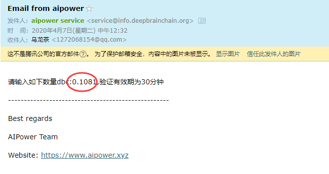
13. 完成绑定后打开收到的邮件并截图，填写推荐人地址`AeiBc1hjnCxhFhS7bujHuathgzot8ztQb6`(谁推荐的就填写他的地址，没人推荐的话就填这个，此地址不参与排行榜奖励，不会形成竞争)，到[群（点这里加群）](#-AI-Power)里发送消息并@宣传管理员
  (微信群：@DBC，QQ群：@191279367)([🕹 管理员介绍](#-管理员介绍))，请确保所有信息填写完整（截图内容参考下图）
- 格式如下：
  ```python
  推荐人地址：
  AeiBc1hjnCxhFhS7bujHuathgzot8ztQb6
  我的地址：
  [这里填写自己的钱包地址]
  [邮箱绑定成功的邮件截图]
  * 邮件截图须包括收件时间，若担心邮件隐私，可以打码遮挡收件地址
  * 海外用户请标注一下（海外）
  ```
- 
14. 管理员看到后就会处理，确认无误就会赠送2400DBC，等待即可
15. 获得DBC后请参考[使用方法](#-使用方法)租借GPU，可执行`python3`命令运行脚本，`pip3`安装库
# 🗝 登录方式
- 登录账号可使用两种方法：
  - 加密文件登录：选择注册时保存的加密文件并输入密码即可
  - 私钥登录：输入私钥即可
# 📃 使用方法
1. 下载ssh工具`MobaXterm`，链接：[https://share.weiyun.com/5uXo25l](https://share.weiyun.com/5uXo25l) 密码：6ara6j
2. 打开🚀`AI Power`网站，点击“机器列表”，等待10秒可用机器列表会先显示出来，然后选择合适的服务器试用或租用。建议一次使用多设置一点时间，时间一到，系统会自动关闭服务器，如果任务提前跑完可以到“我的机器列表”里点击退租，剩下时长会按DBC自动返还到账户里
- 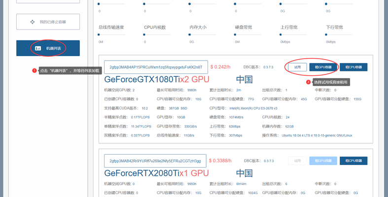
3. 确认下单
- 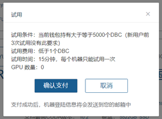
4. 之后会跳转到相应的CPU/GPU容器页面，等待系统检查机器环境
- 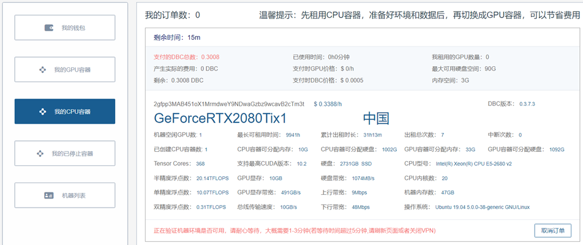
5. 等待检查完毕后完成支付，之后会收到一封邮件，包含服务器的账号密码和一些资料
- 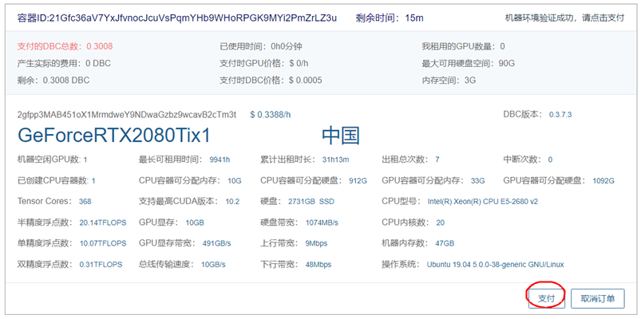
6. 打开我们的工具MobaXterm，选择“New session”新建连接
- 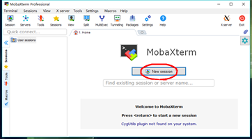
7. 输入服务器地址和端口号，最后点击OK
- 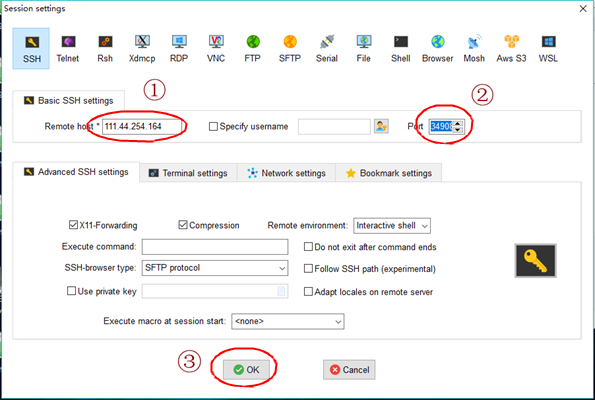
8. 输入账号（root）和密码（输入的过程中不会显示任何字符），按回车确定，点击“Yes”
- 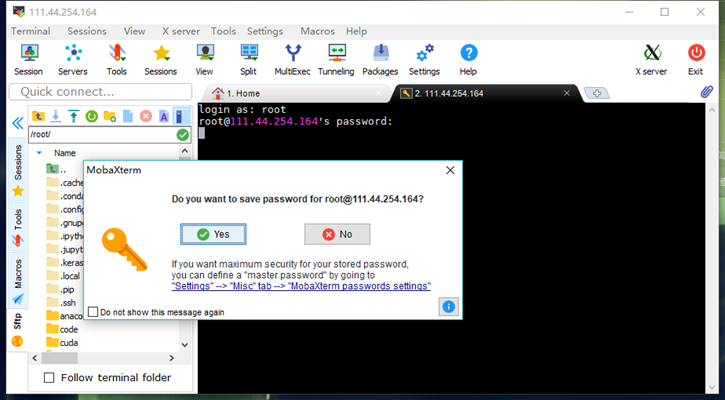
9. 成功登录之后就可以正常使用服务器了，左侧可以管理服务器的文件，右侧是终端，输入`python3 文件名.py`即可运行python脚本，已经预装Pytorch、Tensorflow等。正式训练的时候建议使用screen命令（`screen -S name`）创建离线终端，在离线终端训练文件更加稳定，即使本地退出，服务器也会继续执行脚本。下次登陆服务器后可以使用命令`screen -r -d name`进入之前创建的终端。
- 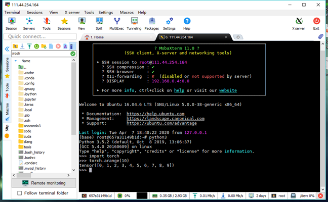
- 通过配置`X11-forwarding`，甚至可以直接在本地图形化界面编写脚本或显示服务器端软件的图形化界面
  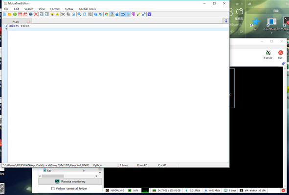
# 🐛 问题汇总
- 本专栏汇总常见问题的解决方案，请先尝试以下相应的解决方法，如果还是不能解决可以联系技术管理员([🕹 管理员介绍](#-管理员介绍))
- PC端推荐使用【Ctrl】+【F】进行问题定位
## ☄ 如何监视显存状态？
- 显存监视命令：`watch -n 1 nvidia-smi`
## ☄ 如何获得DBC？
- a. 参与[活动](#-当前活动)免费获得DBC
- b. 直接进入“[🚀`AI Power`](https://www.aipower.xyz)-我的钱包-如何购买DBC(蓝色字体)”，选择支付宝或其他方式充值
- c. 在网站的[出租栏](https://www.aipower.xyz/miner/myMachineUnlock)上架闲置的GPU获取收益
## ☄ 如何转账？
- 打开[🚀`AI Power`](https://www.aipower.xyz)，进入“我的钱包”，在转账框内输入接收方地址和转账金额点击“发送即可”
## ☄ 如何出售？
- 直接进入“[🚀`AI Power`](https://www.aipower.xyz)-我的钱包-如何出售DBC(橙色字体)”，选择合适的方式出售
## ☄ 如何申请发票？
- 通过支付宝平台购买DBC是支持开发票的，如有需要可以联系宣传管理员，我们会拉您入群并和财务对接，建议通过微信联系，反馈速度较快
## ☄ 服务器是什么操作系统？
- 每个机器的操作系统可能不同，包括Ubuntu16/18/19等，请参考“机器列表”的详细内容
- 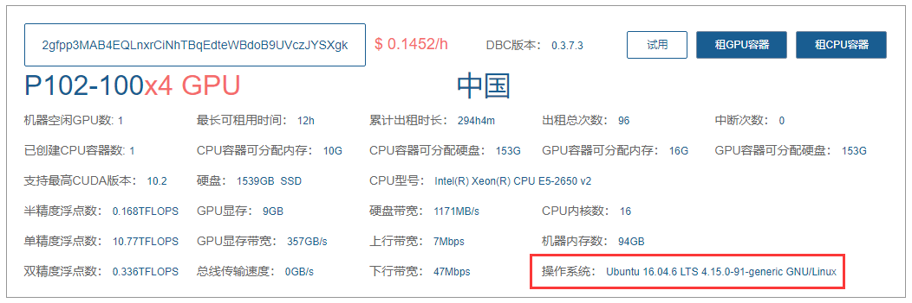
## ☄ CUDA版本是多少？
- 一般是10.0，每个机器情况可能不同，可以先通过试用，输入命令`nvcc -V`查看
## ☄ Pycharm怎么连接服务器？
- 只有 Professional 版的 Pycharm 才有 ssh interpreter 功能，详情可以参考[这篇博客](https://blog.csdn.net/YiRanZhiLiPoSui/article/details/81042287)
## ☄ 找不到预置框架？
- 确认租借的时候选择了需要的框架，如果没有则需要执行命令`pip3 install 框架名`安装一下
- 请参考[使用方法](#-使用方法)，python命令默认执行pthon2，只有python3预置了框架。执行python文件的时候需要输入`python3 文件名`然后执行
## ☄ Jupyter文件路径在哪？
- `/code`
- 可以使用命令`!pwd`查看当前路径，其中`!`代表执行终端指令
# ⚔ 邀请排行榜及绑定总人数统计
- 👨‍👨‍👧‍👦  当前共有 **70** 位成员

- 注：邀请时间以绑定后在群上领奖的消息发出时间为准，排行榜奖励规则请参考[四月限时活动](#-4月限时活动)
- 2020/4/18日 🏹 单日排行榜：
  |推荐人地址|已邀请人数| 
  |------|---| 
  |AHNoU...|3|
  |AdQcN...|1|
  |ALsVs...|1|
  |AZkXa...|1|
  - `更新时间：2020/4/18 18:51，如有遗漏请联系群主修改`
  
- 🎊 总排行榜：
  |推荐人地址|已邀请人数|  
  |------|---|
  |AUeSs...|7|
  |ATACW...|5|
  |AdgxR...|5|
  |AHNoU...|5|
  |AHJou...|3|
  |AKWNq...|3|
  |AUZub...|2|
  |AcooT...|1|
  |Ac1pK...|1|
  |ANjHp...|1|
  |AKMqD...|1|
  |AWtBD...|1|
  |AdQcN...|1|
  |ALsVs...|1|
  |AZkXa...|1|

- 往期排行榜首：
  |日期|榜首|  
  |------|---|
  |2020/4/13|AdgxR.../ATACW.../AUZub...|
  |2020/4/14|AdgxR...|
  |2020/4/15|AHJou...|
  |2020/4/16|AKWNq...|
  |2020/4/17|AUeSs...|
# 💫 宣传参考图
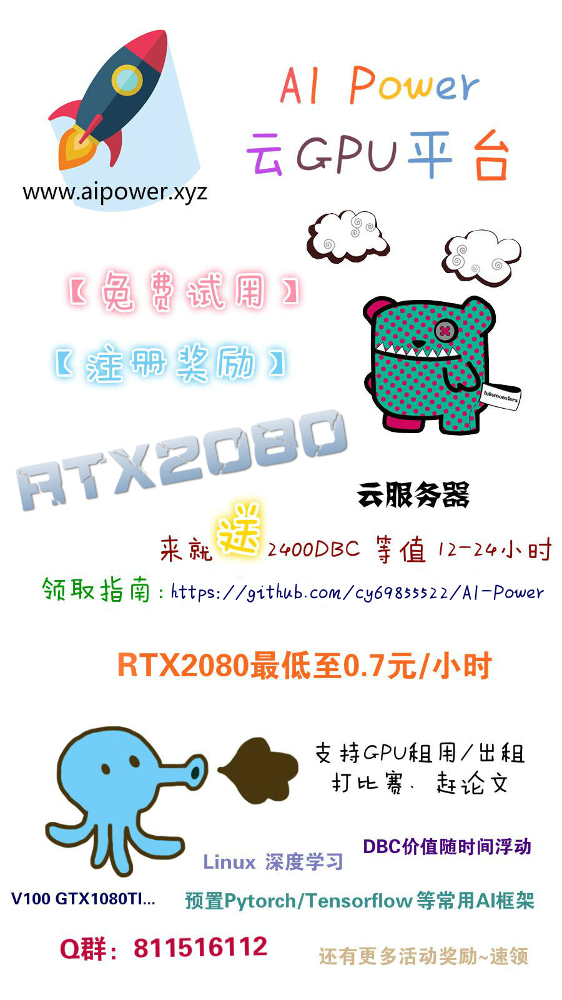
