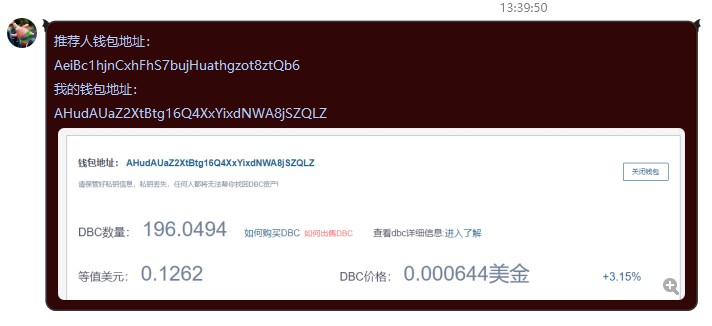
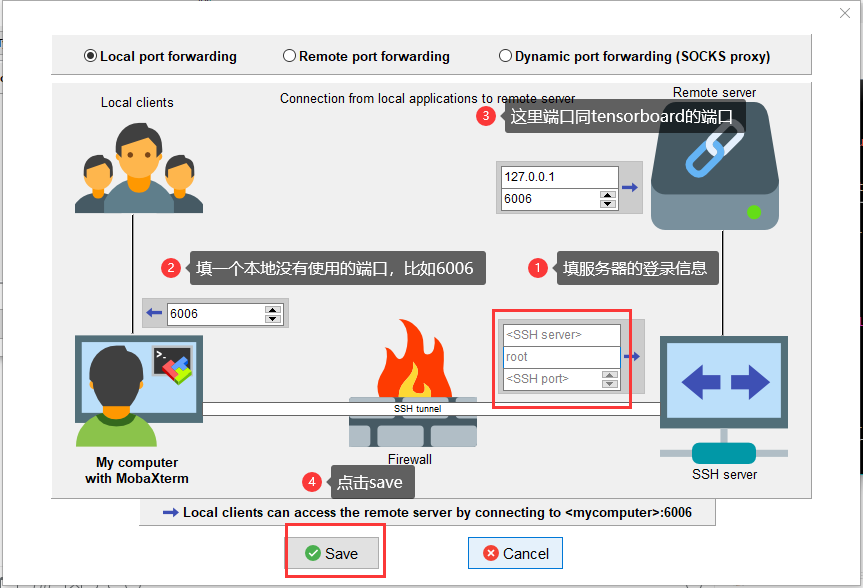

# 🛸 AI-Power
AI动力(AI Power) GPU云平台使用指南，[EN: Switch to English version](README-en.md)
- QQ群:`811516112`，[🖼二维码](resource/AI动力-GPU云平台群聊二维码.png)，（注意：这几天广告号猖獗，加Q群时**请填写您的学校和专业**，答非所问可能会被视作广告号。如果想快速通过请进微信群，造成不便十分抱歉。）
- 微信群：[🖼二维码](resource/微信群.png)，如果二维码过期，请联系微信号`ly18597591102`加群
- 微信公众号：`aipowergpu`，[🖼二维码](resource/公众号.jpg)
- 如有疑问欢迎发issue，或在群内讨论
- `🍳 注意：下面的教程都是有图片的，如果`**`看不到Github的图片`**`说明你的网络配置有问题，请参考`[这篇博客](https://blog.csdn.net/qq_38232598/article/details/91346392)`修复一下~`
- [📕 CSDN介绍文](https://blog.csdn.net/qq_34361099/article/details/105440223) | [📺 bilibili视频介绍及租用演示](https://www.bilibili.com/video/BV1QK411V7nv) | [📮 知乎介绍文](https://zhuanlan.zhihu.com/p/128161051)
- [✨ **新用户注册与奖励领取流程，戳这里~**](#-注册与新用户奖励)

## 🎉 长期福利活动
- 注：DBC指算力积分，可用于租用算力。新用户奖励总计3000DBC，等价于20~30小时P102/1080ti算力（价格随时间浮动）
1. 注册并绑定邮箱即可获得💎1000DBC，首周DBC使用量达1000DBC, 再送💎2000DBC，注册及领取流程请参考[这里](#-注册与新用户奖励)
2. 邀请新用户可得💎1000DBC，新用户首周DBC使用量达1000DBC, 邀请奖励追加💎2000DBC，海外用户奖励翻倍。（达到1000DBC使用量后就可以立即领取，发送订单截图和钱包地址@宣传管理员即可）
3. 如果整个班级（实验室）一起加入平台，平均每个人可获得💎6000DBC奖励，这种情况请联系群主
4. 转发朋友圈或QQ空间并获得10赞或以上，奖励💎2400DBC
5. 微信公众号宣传100以上阅读量，奖励💎2000DBC
6. 累积邀请达10人，可获得🎼小智音箱一台
7. 参与[B站推广视频](https://www.bilibili.com/video/BV1QK411V7nv)点赞与评论可获得💎1000DBC
8. 参与[知乎推广文章](https://zhuanlan.zhihu.com/p/128161051)点赞与评论可获得💎1000DBC
9. 参与[YouTube推广视频](https://www.youtube.com/watch?v=zMdAmQf4iuc)点赞与评论可获得💎2000DBC，墙内用户可能无法访问
10. 长租服务器可以获得👑DBC返还

## 🌈 七月限时福利活动
- ⏱ 活动时间：2020年7月6号上午10点-7月13号晚上22点
- 1、活动期间使用长租功能（按周、月、年），并且不退租，除了享受平台上标示的折扣，官方额外再补贴👑（5-10%）
- 2、邀请一位真实有效GPU用户（比赛用户、研究生优先）奖励3000DBC，每增加一人多奖励500DBC，依次累计；比如说邀请3人，奖励的DBC总数3000+3500+4000DBC=10500DBC；上线邀请10人可得（52500DBC），但作弊或者邀请无关人员，一经发现取消资格；累计5人奖励👕T恤一件，10人奖励🎼蓝牙音箱一台
- 3、新用户每人奖励💎5000DBC（AI相关专业、比赛用户、研究生优先），先打2500，一周内用完打剩余的2500DBC

# 目录
- [🕹 管理员介绍](#-管理员介绍)
- [✨ 注册与新用户奖励](#-注册与新用户奖励)
- [🗝 登录方式](#-登录方式)
- [📃 使用方法](#-使用方法)
- [🐛 问题汇总](#-问题汇总)
  - [如何监视显存状态？](#-如何监视显存状态)
  - [如何获得DBC？](#-如何获得DBC)
  - [如何转账？](#-如何转账)
  - [如何出售？](#-如何出售)
  - [如何申请发票？](#-如何申请发票)
  - [服务器是什么操作系统？](#-服务器是什么操作系统)
  - [CUDA版本是多少？](#-CUDA版本是多少)
  - [Pycharm怎么连接服务器？](#-Pycharm怎么连接服务器)
  - [找不到预置框架？](#-找不到预置框架)
  - [Jupyter文件路径在哪？](#-Jupyter文件路径在哪)
  - [服务器上的Python是哪个版本？](#-服务器上的Python是哪个版本)
  - [如何切换jupyter的python内核？](#-如何切换jupyter的python内核)
  - [如何设置服务器端口转发，用于tensorboard/jupyter页面等？](#-如何设置服务器端口转发用于tensorboardjupyter页面等)
  - [故障赔付？](#-故障赔付)
  - [如何传输文件？](#-如何传输文件)
  - [到期后数据会保存吗？](#-到期后数据会保存吗)
  - [如何收费？](#-如何收费)
- [💫 宣传参考图](#-宣传参考图)
# 🕹 管理员介绍
- 宣传管理员（微信号：DBC-Lee，微信昵称：DBC / QQ号：191279367，Q群昵称：宣传管理）：负责发放DBC奖励
- 技术管理员（微信号：fengbs600220，微信昵称：deepbrainfeng / QQ号：313785443，Q群昵称：技术管理）：负责技术售后

# ✨ 注册与新用户奖励
**`注意：下面的教程都是有图片的，如果看不到说明你的网络配置有问题，请参考`[这篇博客](https://blog.csdn.net/qq_38232598/article/details/91346392)`修复`**
1. **用PC端打开[`🚀AI动力`](https://www.aipower.xyz)网站 [www.aipower.xyz](https://www.aipower.xyz)**
2. 点击“开始租用GPU”
- 
3. 点击“创建钱包账号”
- 
4. 输入密码，并点击“创建”
- 
5. 下载加密文件并保存，点击“继续”
- 
6. 复制私钥，点击完成
- 
7. 注意一下自己的钱包地址（之后领取奖励会用到），然后点击“如何购买DBC”（充值1元用于绑定邮箱即可，不限制充值方式，以下以支付宝为例）
- 
8. 选择第一个，用支付宝充值（**注意：如果没有支付宝充值入口，请先切换右上角语言为中文**）
- 
9. 确认自己的DBC钱包收款地址（这个会自动生成，看一眼就行），点击“继续”
- 
10. 输入充值金额**≥1元**，用于之后的邮箱绑定（绑定后可以获得**上千DBC的新人奖励**），点击“继续”，并用支付宝支付
- 
11. 回到🚀`AI Power`网站，复制钱包地址，然后点击“我的GPU容器”。（充值的DBC会在几分钟内到账）
- 
12. 点击“绑定邮箱”，点击“收邮件”，会收到一份包含DBC数量（类似验证码）的邮件，输入后即可完成邮箱验证
- 
- 
13. 填写推荐人地址(谁推荐的就填写Ta的地址，没人推荐的话就跳过)和自己的钱包地址并附上余额截图，到[群（点这里加群）](#-AI-Power)里发送消息并`@宣传管理`
  (微信群：@DBC，QQ群：@191279367)([🕹 管理员介绍](#-管理员介绍))，请确保所有信息填写完整（截图内容参考下图）
- 格式如下：
  ```
  推荐人钱包地址：
  
  我的钱包地址：
  
  [钱包地址和余额的截图，注意不要泄露私钥]
  ```
  ```
  * 海外用户可联系群主领取双倍注册奖励，包括留学生；邀请海外用户奖励也双倍
  * 消息格式可参考下图
  ```
- 
14. 管理员看到后就会处理，确认无误就会赠送DBC奖励，一般一天以内，耐心等待即可
15. 获得DBC后请参考[使用方法](#-使用方法)租借GPU，可执行`python3`命令运行脚本，`pip3`安装库
16. 新用户首周使用DBC量达到1000DBC还有额外大量DBC奖励。达标后发送余额截图和订单截图到群上`@宣传管理`即可领取
# 🗝 登录方式
- 登录账号可使用两种方法：
  - 加密文件登录：选择注册时保存的加密文件并输入密码即可
  - 私钥登录：输入私钥即可
# 📃 使用方法
1. 下载ssh工具`MobaXterm`，链接：[https://share.weiyun.com/5uXo25l](https://share.weiyun.com/5uXo25l) 密码：6ara6j
2. 打开🚀`AI Power`网站，点击“机器列表”，等待10秒可用机器列表会先显示出来，然后选择合适的服务器试用或租用。建议一次使用多设置一点时间，时间一到，系统会自动关闭服务器，如果任务提前跑完可以到“我的机器列表”里点击退租，剩下时长会按DBC自动返还到账户里
- 
3. 确认下单
- 
4. 之后会跳转到相应的CPU/GPU容器页面，等待系统检查机器环境
- 
5. 等待检查完毕后完成支付，之后会收到一封邮件，包含服务器的账号密码和一些资料
- 
6. 打开我们的工具MobaXterm，选择“New session”新建连接
- 
7. 输入服务器地址和端口号，最后点击OK
- 
8. 输入账号（root）和密码（**输入的过程中不会显示任何字符**），按回车确定，点击“Yes”
- 
9. 成功登录之后就可以正常使用服务器了，左侧可以管理服务器的文件，右侧是终端，输入`python3 文件名.py`即可运行python脚本，已经预装Pytorch、Tensorflow等。正式训练的时候建议使用screen命令（`screen -S name`）创建离线终端，在离线终端训练文件更加稳定，即使本地退出，服务器也会继续执行脚本。下次登陆服务器后可以使用命令`screen -r -d name`进入之前创建的终端。
- 
- 通过配置`X11-forwarding`，甚至可以直接在本地图形化界面编写脚本或显示服务器端软件的图形化界面，具体操作可参考[这篇公众号文章](https://mp.weixin.qq.com/s?__biz=MzU4OTYwODQ0NQ==&mid=2247483767&idx=1&sn=2d63e526146ccca3a6672e7713a8feb2&chksm=fdcba5e5cabc2cf3b06432a32dcb1f9824b4e5bea082b5bc2dd46c2413e6f719637aad4ae397&mpshare=1&scene=23&srcid=&sharer_sharetime=1588830034150&sharer_shareid=e8efbc9321770363ac04fcab1ca67c24#rd)
- 
# 🐛 问题汇总
- 本专栏汇总常见问题的解决方案，请先尝试以下相应的解决方法，如果还是不能解决可以联系技术管理员([🕹 管理员介绍](#-管理员介绍))
- PC端推荐使用【Ctrl】+【F】进行问题定位
## ☄ 如何监视显存状态？
- 显存监视命令：`watch -n 1 nvidia-smi`
## ☄ 如何获得DBC？
- a. 参与[活动](#-当前活动)免费获得DBC
- b. 直接进入“[🚀`AI Power`](https://www.aipower.xyz)-我的钱包-如何购买DBC(蓝色字体)”，选择支付宝或其他方式充值
- c. 在网站的[出租栏](https://www.aipower.xyz/miner/myMachineUnlock)上架闲置的GPU获取收益
## ☄ 如何转账？
- 打开[🚀`AI Power`](https://www.aipower.xyz)，进入“我的钱包”，在转账框内输入接收方地址和转账金额点击“发送即可”
## ☄ 如何出售？
- 直接进入“[🚀`AI Power`](https://www.aipower.xyz)-我的钱包-如何出售DBC(橙色字体)”，选择合适的方式出售
## ☄ 如何申请发票？
- 通过支付宝平台购买DBC是支持开发票的，如有需要可以联系宣传管理员，我们会拉您入群并和财务对接，建议通过微信联系，反馈速度较快
## ☄ 服务器是什么操作系统？
- 每个机器的操作系统可能不同，包括Ubuntu16/18/19等，请参考“机器列表”的详细内容
- 
## ☄ CUDA版本是多少？
- 一般是10.0，每个机器情况可能不同，可以先通过试用，输入命令`nvcc -V`查看
## ☄ Pycharm怎么连接服务器？
- 只有 Professional 版的 Pycharm 才有 ssh interpreter 功能，详情可以参考[这篇博客](https://blog.csdn.net/YiRanZhiLiPoSui/article/details/81042287)
## ☄ 找不到预置框架？
- 确认租借的时候选择了需要的框架，如果没有则需要执行命令`pip3 install 框架名`安装一下
- 请参考[使用方法](#-使用方法)，python命令默认执行pthon2，只有python3预置了框架。执行python文件的时候需要输入`python3 文件名`然后执行
## ☄ Jupyter文件路径在哪？
- `/code`
- 可以使用命令`!pwd`查看当前路径，其中`!`代表执行终端指令
## ☄ 服务器上的Python是哪个版本？
- 在租用服务器的时候可以选择镜像
  - pytorch1.1版的python3版本默认3.5，python2版本默认2.7。但同时预置了3.67版本的，可以使用命令`conda activate python367`进行激活，`conda deactivate`取消激活
  - pytorch1.4版默认已经激活python3.67，退出激活后python3为3.7版本，python2为2.7版本
## ☄ 如何设置服务器端口转发，用于tensorboard/jupyter页面等？
- 方法一：
  - 直接通过设置x11-forwarding转发服务器的图形界面
- 方法二：
  - 打开MobaXterm的Tunnel
  - 
  - 输入服务器的登录信息还有需要转发的服务器端口和本地的接收端口
  - 
  - 启动端口转发
  - 
  - 在本地用浏览器打开对应端口即可
## ☄ 如何切换jupyter的python内核？
- 请参考群文件的“[设置jupyter与base环境一致.doc](resource/设置jupyter与base环境一致.doc)”
## ☄ 故障赔付？
- 关于服务器售后，机器使用过程中万一出现中断故障等极个别情况，请重启后检查数据是否丢失。若数据丢失，可发订单截图和钱包地址以及损失的DBC数量领取赔偿。144小时内断开连接损失全额赔付。首先还是要建议大家科学使用，只有属于平台方的原因才会赔付。另外建议大家质押2万以上DBC，环境可以免费保存一周，一周内启动即可，不用担心数据和环境丢失。
## ☄ 如何传输文件？
- 对于小文件，可通过MobaXterm的左侧图形化界面传输
- 对于大文件，建议通过注册时收到的邮件里面提供的私人网盘传输，速度快
## ☄ 到期后数据会保存吗？
-  时间到期,容器会被停用.并且如果钱包余额不足20000DBC,容器将会被销毁.如果您的钱包余额超过20000DBC,机器所有数据将会被自动保留7天(在这期间钱包余额也必须超过20000DBC),7天内任何时间可以继续启用容器,进行使用,容器停止超过7天将会被销毁
- 除此之外可以通过租用CPU容器保存数据，质押方式不产生费用，租用方式收取费用
## ☄ 如何收费？
- 每台机器的价格都不同，建议选择最划算的
- 容器使用完成后，可以提前退租，只会收取实际产生的费用，剩余费用将会退还到钱包中
# 💫 宣传参考图

