# AI-Power
AI动力(AI Power) GPU云平台使用指南

# 管理员介绍
- 注册管理员（微信号：DBC-Lee，微信昵称：DBC）：负责审核/发放注册奖励
- 技术管理员（微信号：fengbs600220，微信昵称：deepbrainfeng）：负责技术售后

# 注册 + 领取新用户奖励
1. 打开`🚀AI动力`网站[www.aipower.xyz](https://www.aipower.xyz)
2. 点击“开始租用GPU”
- 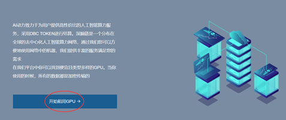
3. 点击“创建钱包账号”
- 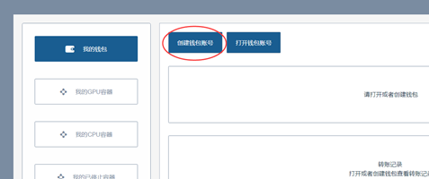
4. 输入密码，并点击“创建”
- 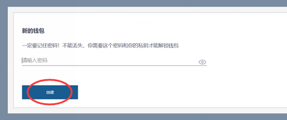
5. 下载加密文件并保存，点击“继续”
- 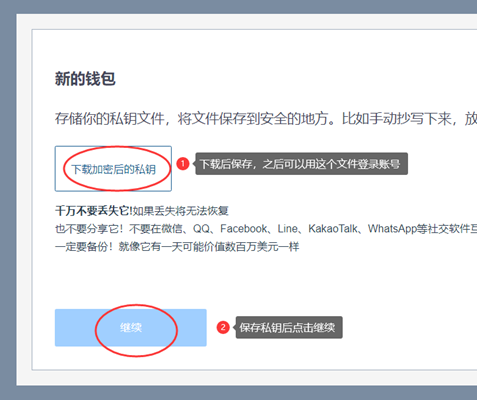
6. 复制私钥，点击完成
- 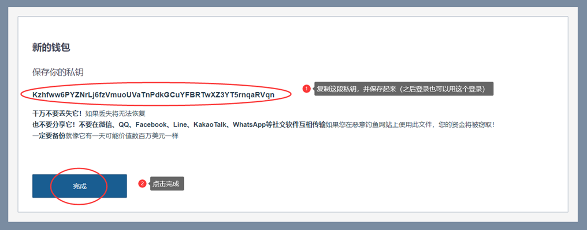
7. 到此账号已注册完毕，接下来可以领取新人奖励。注意一下自己的钱包地址，然后点击“如何购买DBC”
- 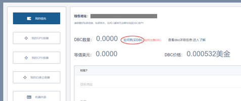
8. 选择第一个，用支付宝充值（绑定邮箱需要账户内至少拥有1个DBC，不足0.01元）
- 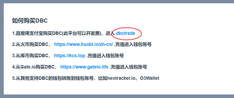
9. 确认自己的DBC钱包收款地址，点击继续
- 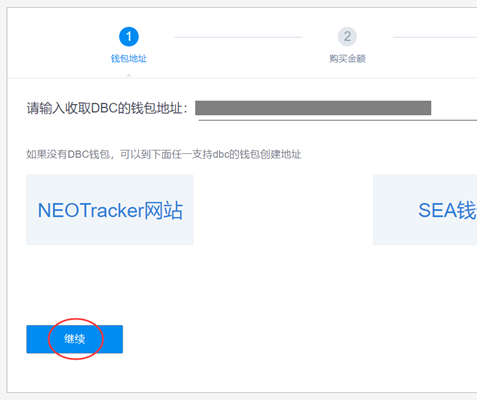
10. 输入想要充值的金额，确保至少价值1DBC，用于之后的邮箱绑定（绑定后可以获得上千DBC的新人奖励），点击“继续”，并用支付宝扫码付款
- 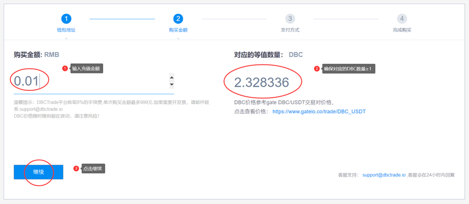
11. 回到🚀`AI Power`网站，复制钱包地址，然后点击“我的GPU容器”
- 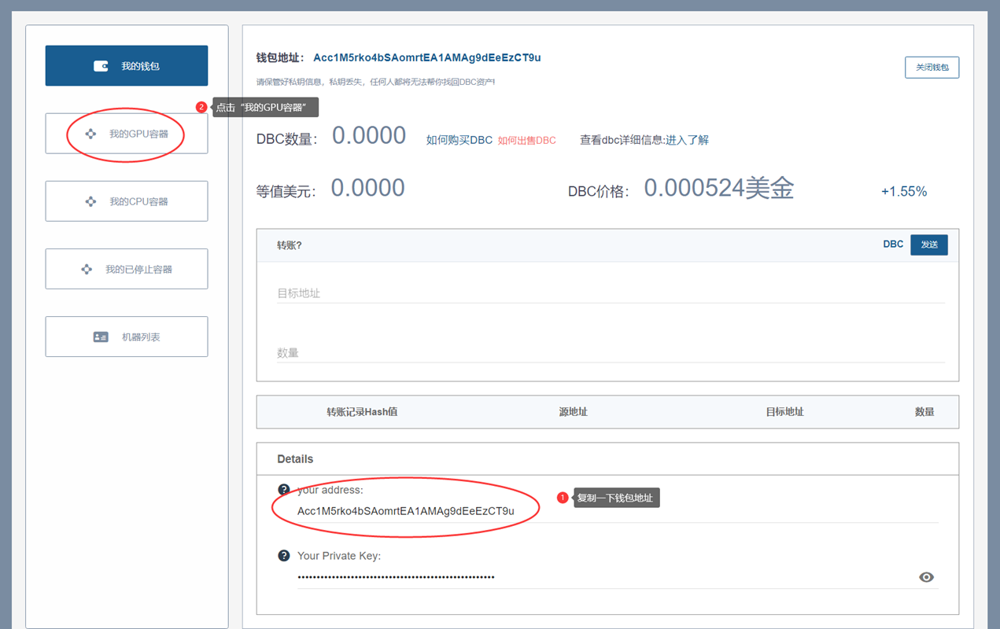
12. 点击“绑定邮箱”，完成邮箱验证
- 
13. 完成绑定后打开收到的邮件并截图，填写推荐人地址`AeiBc1hjnCxhFhS7bujHuathgzot8ztQb6`，到群里发送消息
- 格式如下：
  ```python
  推荐人地址：
  AeiBc1hjnCxhFhS7bujHuathgzot8ztQb6
  我的地址：
  [这里填写自己的钱包地址]
  [邮箱绑定成功的邮件截图]
  ```
- 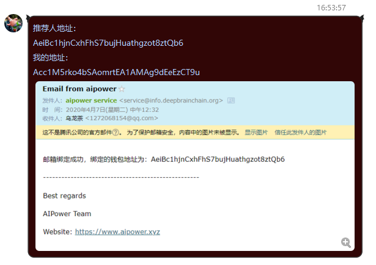
14. 管理员看到后就会处理，等待即可
# 登录
- 登录账号可使用两种方法：
  - 加密文件登录：选择注册时保存的加密文件并输入密码即可
  - 私钥登录：输入私钥即可
# 使用方法
1. 下载ssh工具`MobaXterm`，链接：https://share.weiyun.com/5uXo25l(https://share.weiyun.com/5uXo25l) 密码：6ara6j
2. 打开🚀`AI Power`网站，点击“机器列表”，等待10秒可用机器列表会先显示出来，然后选择合适的服务器试用或租用
- 
3. 确认下单
- 
4. 之后会跳转到相应的CPU/GPU容器页面，等待系统检查机器环境
- 
5. 等待检查完毕后完成支付，之后会收到一封邮件，包含服务器的账号密码和一些资料
- 
6. 打开我们的工具MobaXterm，选择“New session”新建连接
- 
7. 输入服务器地址和端口号，最后点击OK
- 
8. 输入账号（root）和密码（输入的过程中不会显示任何字符），按回车确定，点击“Yes”
- 
9. 成功登录之后就可以正常使用服务器了，左侧可以管理服务器的文件，右侧是终端，输入`python3 文件名.py`即可运行python脚本，已经预装Pytorch、Tensorflow等
- 
# 问题汇总
- 本专栏汇总常见问题的解决方案，请先尝试以下相应的解决方法，如果还是不能解决可以联系技术管理员
